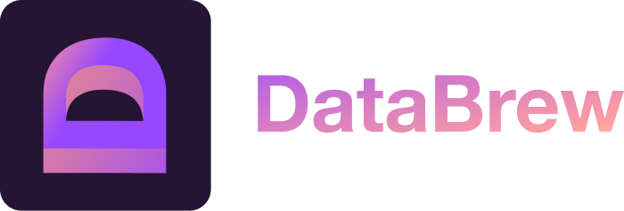

# PostgreSQL Logical Replication CDC Module for Go



This Go module builds upon [github.com/jackc/pglogrepl](https://github.com/jackc/pglogrepl) to provide an advanced
logical replication solution for PostgreSQL. It extends the capabilities of jackc/pglogrep for logical replication by
introducing several key features, making it easier to implement Change Data Capture (CDC) in your Go-based applications.

## Features

- **Checkpoints Storing:** Efficiently manage and store replication checkpoints, facilitating better tracking and
  management of data changes.

- **Snapshot Streaming:** Seamlessly capture and replicate snapshots of your PostgreSQL database, ensuring all data is
  streamed through the pipeline.

- **Table Filtering:** Tailor your CDC process by selectively filtering and replicating specific tables, optimizing
  resource usage.

## Getting Started

Follow these steps to get started with our PostgreSQL Logical Replication CDC Module for Go:

### Install the module

```go
import (
    "github.com/usedatabrew/pglogicalstream"
)

```

### Configure your replication stream

Create `config.yaml` file

```yaml
db_host: database host
db_password: password12345
db_user: postgres
db_port: 5432
db_name: mocks
db_schema: public
db_tables:
  - rides
replication_slot_name: morning_elephant
tls_verify: require
stream_old_data: true
```

### Basic usage example

By default`pglogicalstream`will create replication slot and publication for the tables you provide in Yaml config
It immediately starts streaming updates and you can receive them in the `OnMessage` function

```go
package main

import (
  "fmt"
  "github.com/usedatabrew/pglogicalstream"
  "gopkg.in/yaml.v3"
  "io/ioutil"
  "log"
)

func main() {
  var config pglogicalstream.Config
  yamlFile, err := ioutil.ReadFile("./example/simple/config.yaml")
  if err != nil {
    log.Printf("yamlFile.Get err   #%v ", err)
  }

  err = yaml.Unmarshal(yamlFile, &config)
  if err != nil {
    log.Fatalf("Unmarshal: %v", err)
  }

  pgStream, err := pglogicalstream.NewPgStream(config, nil)
  if err != nil {
    panic(err)
  }

  // Listen to messages here
  pgStream.OnMessage(func(message []byte) {
    fmt.Println(string(message))
  })
}
```

### Example with checkpointer

In order to recover after the failure, etc you have to store LSN somewhere to continue streaming the data
You can implement `CheckPointer` interface and pass it's instance to  `NewPgStreamCheckPointer` and your LSN
will be stored automatically

```go
checkPointer, err := NewPgStreamCheckPointer("redis.com:port", "user", "password")
if err != nil {
    log.Fatalf("Checkpointer error")
}
pgStream, err := pglogicalstream.NewPgStream(config, checkPointer)
```

### Enable checkpoints by implementing CheckPointer inteface

```go
type CheckPointer interface {
    SetCheckPoint(lsn, slot string) error
    GetCheckPoint(slot string) string
}
```

### Checkpointer implementation example

```go
package main

import (
  "fmt"
  "github.com/go-redis/redis/v7"
)

type PgStreamCheckPointer struct {
  redisConn *redis.Client
}

func NewPgStreamCheckPointer(addr, user, password string) (*PgStreamCheckPointer, error) {
  client := redis.NewClient(&redis.Options{
    Addr:     addr,
    Username: user,
    Password: password,
  })
  conn := client.Conn()
  result := conn.Ping()
  if result.Err() != nil {
    return nil, result.Err()
  }

  return &PgStreamCheckPointer{
    redisConn: client,
  }, nil
}

func (p *PgStreamCheckPointer) SaveCheckPoint(lnsCheckPoint, replicationSlot string) error {
  return p.redisConn.Set(fmt.Sprintf("databrew_checkpoint_%s", replicationSlot), lnsCheckPoint, 0).Err()
}

func (p *PgStreamCheckPointer) GetCheckPoint(replicationSlot string) string {
  result, _ := p.redisConn.Get(fmt.Sprintf("databrew_checkpoint_%s", replicationSlot)).Result()
  return result
}

func (p *PgStreamCheckPointer) Close() error {
  if p.redisConn != nil {
    return p.redisConn.Close()
  }

  return nil
}
```

## Contributing

We welcome contributions from the Go community!

### License

This project is licensed under the [MIT License](LICENSE).